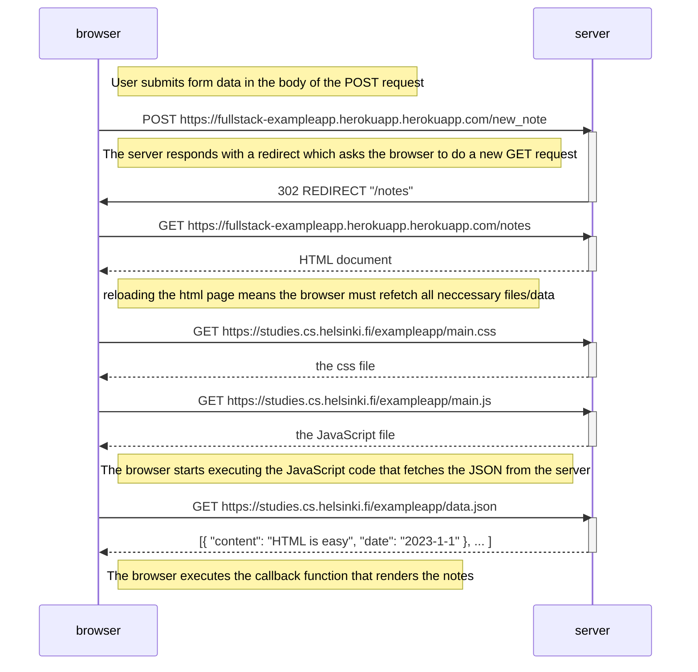

```mermaid

sequenceDiagram
  participant browser
  participant server

  Note right of browser: User submits form data in the body of the POST request

  browser->>server: POST https://fullstack-exampleapp.herokuapp.herokuapp.com/new_note
  activate server

  Note right of browser: The server responds with a redirect which asks the browser to do a new GET request

  server->>browser: 302 REDIRECT "/notes"
  deactivate server

  browser->>server: GET https://fullstack-exampleapp.herokuapp.herokuapp.com/notes
  activate server
  server-->>browser: HTML document
  deactivate server

  Note right of browser: reloading the html page means the browser must refetch all neccessary files/data

  browser->>server: GET https://studies.cs.helsinki.fi/exampleapp/main.css
  activate server
  server-->>browser: the css file
  deactivate server

  browser->>server: GET https://studies.cs.helsinki.fi/exampleapp/main.js
  activate server
  server-->>browser: the JavaScript file
  deactivate server

  Note right of browser: The browser starts executing the JavaScript code that fetches the JSON from the server

  browser->>server: GET https://studies.cs.helsinki.fi/exampleapp/data.json
  activate server
  server-->>browser: [{ "content": "HTML is easy", "date": "2023-1-1" }, ... ]
  deactivate server

  Note right of browser: The browser executes the callback function that renders the notes


```
