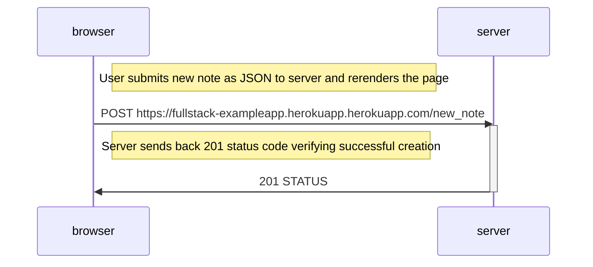

```mermaid

sequenceDiagram
  participant browser
  participant server

  Note right of browser: User submits new note as JSON to server and rerenders the page

  browser->>server: POST https://fullstack-exampleapp.herokuapp.herokuapp.com/new_note
  activate server

  Note right of browser: Server sends back 201 status code verifying successful creation

  server->>browser: 201 STATUS
  deactivate server

```
